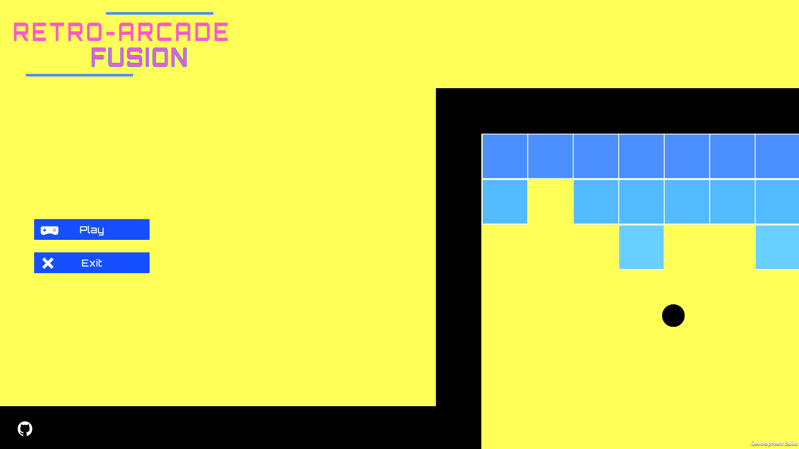
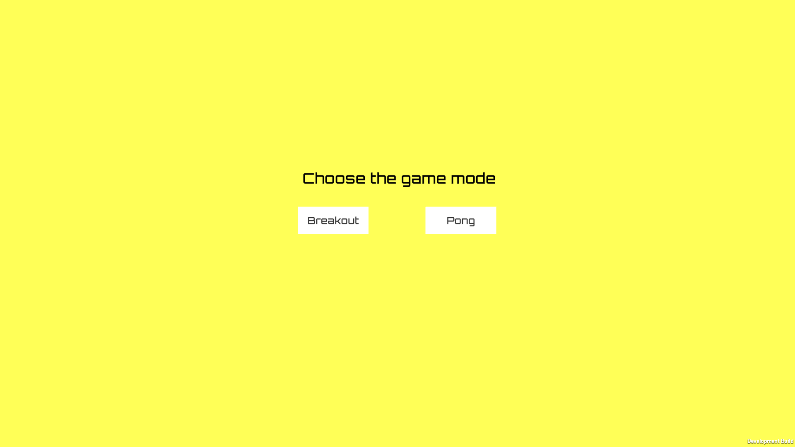
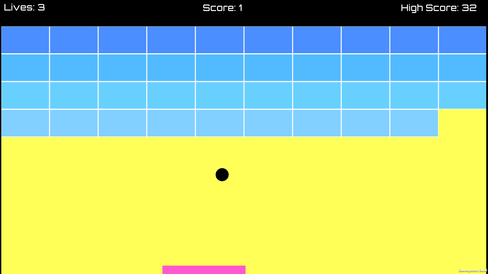
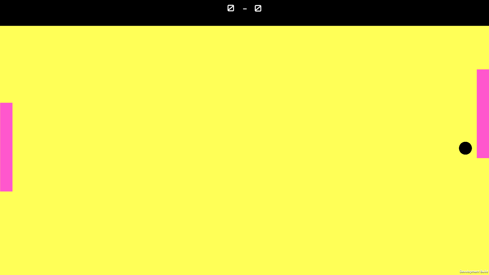

# RETRO-ARCADE FUSION


## Overview

RETRO-ARCADE FUSION is a game project I developed as part of my learning journey with Unity game engine. It features two classic arcade game modes: Breakout and Pong. This project allowed me to gain valuable experience in game development, from designing gameplay mechanics to implementing game physics and user interfaces.

## Features
- Two classical game modes:
  
  - **Breakout**: Smashing bricks is satisfyingin this classic arcade game.
  
  - **Pong**: Test your reflexes in the iconic Pong game.
  
- Intuitive controls:
  - Easy to learn controls ensure players can jump right into the action.
- High Score Tracking.

## Getting Started
To play RETRO-ARCADE FUSION, follow these steps:
1. clone the repository:  
```bash
  git clone https://github.com/Vulpes19/RETR0-ARCADE-FUSION.git
```   
2. Open the project in Unity.
3. Build and run the game.
ps: notice that the game is under testing, a direct download link will be provided once the game is past the testing phase.

## How to Play
1. **Breakout Mode**: Use the paddle to bounce the ball and destroy all the bricks. Notice that you have 3 lives if you miss the ball you lose one.
2. **Pong Mode**: Control the paddle to hit the ball and score points against the AI paddle.
3. Press ESC if you wanna pause the game, and use the arrows to move paddle.

## Roadmap
I have exciting plans for the future of RETRO-ARCADE FUSION, including:
- An additional game mode inspired by a nostalgic retro game.
- Implementing multiplayer functionality for Pong mode.
- Enhancing the AI in Pong mode.
